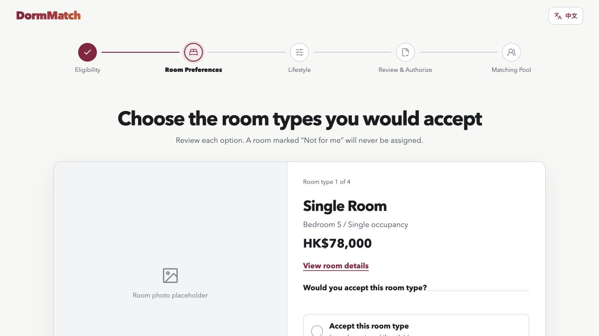

# DormMatch

DormMatch is a bilingual, auditable residence-allocation prototype for students applying to CityUHK's South Mountain Residence. It replaces fragile self-organized teams and speed-based payment races with individual applications, a synchronized lottery, preference-aware bed allocation, and post-allocation lifestyle grouping.



> **Independent hackathon prototype:** DormMatch is not an official City University of Hong Kong service and is not affiliated with or endorsed by CityUHK. Identity verification, payment authorization, residence inventory, and applicant data are simulated for demonstration.

## The problem

In a team-based residence application, one student's late payment or withdrawal can affect an entire group. Students may also be forced to form teams before they know whether everyone will complete the process. DormMatch explores a different model:

- every eligible student applies independently;
- everyone who completes the application before the deadline enters together;
- submission time does not improve priority;
- students rank only the bedrooms they would genuinely accept;
- payment is captured only after a successful allocation;
- lifestyle answers arrange suite-mates only after beds have been allocated.

## Product flow

1. **Eligibility** — simulated CityU EID identity and housing-partition verification.
2. **Room Preferences** — accept or reject each official bedroom option, then rank the accepted options.
3. **Lifestyle** — six structured questions covering sleep, wake time, cleanliness, noise, visitors, and temperature.
4. **Review & Authorize** — review the application and authorize up to the highest accepted bed price.
5. **Matching Pool** — receive a lottery priority, wait for centralized allocation, and view a successful or unsuccessful result.

The interface supports English and native Simplified Chinese throughout the complete flow.

## Fair allocation design

DormMatch deliberately separates two decisions:

### 1. Who receives a bed

The bed-allocation engine processes applicants by lottery priority and considers only accepted bedrooms, preference order, available inventory, and housing partition. It uses an augmenting-path matching strategy, which can move a flexible applicant to another accepted bedroom when that allows an additional student to receive a bed.

Lifestyle answers do **not** affect eligibility, lottery priority, bedroom allocation, or price.

### 2. Who shares a suite

After bed allocation, the suite-placement engine compares the six lifestyle answers with equal weight. It creates complete groups of up to eight residents, uses every successful applicant once, and reports a transparent compatibility estimate and the strongest aligned dimensions.

The score is a deterministic estimate, not a guarantee of roommate satisfaction and not a machine-learning judgment about a student's worthiness.

## Transparent payment model

The prototype simulates a CityU-controlled authorization flow:

- no charge is taken when the application enters the matching pool;
- a successful applicant is charged the actual allocated bed price;
- an unsuccessful applicant is charged HK$0 and the authorization is released;
- DormMatch never asks for or stores card details.

## Technology

- React 19
- Vite 7
- JavaScript
- Lucide and Phosphor icons
- deterministic bipartite allocation engine
- deterministic suite-compatibility grouping
- Node's built-in test runner

No OpenAI API is called at runtime. Matching decisions and result explanations are generated from transparent deterministic rules so the prototype remains free to run and auditable.

## Run locally

Requirements: Node.js 20 or newer.

```bash
npm install
npm run dev
```

Open [http://127.0.0.1:5173/](http://127.0.0.1:5173/).

To create a production build:

```bash
npm run build
npm run preview
```

## Test the project

Run the fixed behavioral tests:

```bash
npm test
```

These tests cover lottery order, accepted preferences, maximum bed utilization, partition restrictions, actual-price charging, failed-payment release, deterministic behavior, suite compatibility, complete eight-person grouping, and the rule that lifestyle answers never affect bed access.

Run the randomized simulation suite:

```bash
npm run test:simulation
```

The simulation generates:

- 10,000 small random scenarios cross-checked against a separate brute-force optimum;
- 100 large scenarios with up to 500 applicants and 300 beds;
- 200 fairness rounds with 240 identical applicants competing for 214 beds.

Use a different reproducible seed with:

```bash
SIMULATION_SEED=12345 npm run test:simulation
```

Code quality and build checks:

```bash
npm run lint
npm run build
```

## How Codex was used

Codex was the primary development collaborator for DormMatch during OpenAI Build Week. The collaboration included:

- turning a real student residence problem into a five-step product flow;
- challenging edge cases such as oversubscription, identical preferences, narrow preferences, payment timeouts, waitlist behavior, and incomplete suites;
- separating the fair lottery from post-allocation lifestyle grouping;
- researching and structuring official bedroom information for the prototype;
- implementing the bilingual React interface and responsive stepper;
- creating the allocation and suite-grouping engines;
- writing fixed, randomized, stress, and fairness tests;
- reviewing misleading product claims and replacing the former GPT-labelled result text with an auditable explanation.

The human product decisions remained explicit. In particular, the project owner decided to remove friend binding, reject speed-based priority, avoid free-text lifestyle answers, keep all six lifestyle dimensions equally weighted, and prevent compatibility scores from influencing bed eligibility.

### Codex evidence for the submission

The primary DormMatch build task was shared through Codex `/feedback` for the hackathon submission:

```text
Primary Codex Session ID: 019f70b9-2ec5-7f12-887a-c70b4f6bf8bb
```

## Repository structure

```text
src/
  screens/                 Five application steps
  components/              Shared interface components
  matchingEngine.js        Lottery and bed allocation
  suiteMatching.js         Lifestyle compatibility and suite grouping
  i18n.js                  English and Chinese product copy
tests/
  matchingEngine.test.js   Fixed allocation scenarios
  suiteMatching.test.js    Compatibility and grouping scenarios
  matchingEngine.simulation.js
                            Random, stress, and fairness simulation
public/images/rooms/        Original room visualizations for the prototype
outputs/                    Product screenshots and flow documentation
```

## Privacy and production limitations

This is a front-end prototype with simulated data. A production deployment would require official CityU authorization and infrastructure for EID authentication, residence inventory, payment callbacks, audit logs, accessibility review, privacy review, security testing, and administrator controls.

## License

The source code is available under the [MIT License](LICENSE). Room visualizations in `public/images/rooms/` were created for this prototype from floor-plan and interior references and should not be treated as official residence photography.
